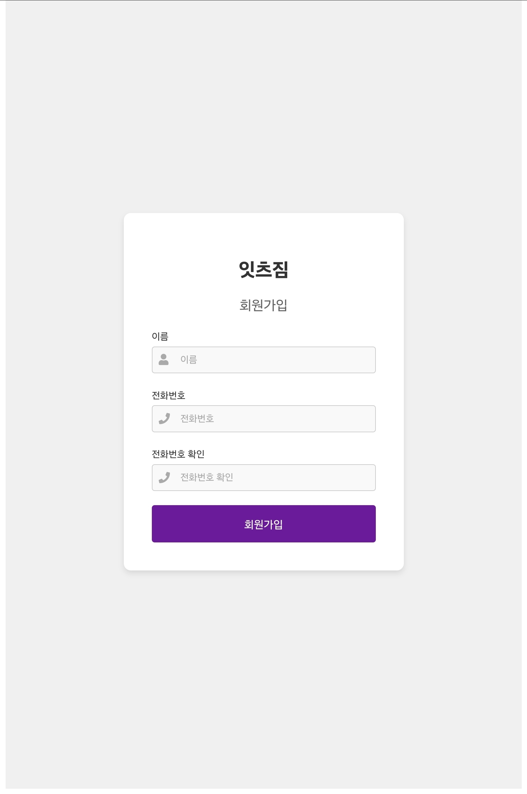

# ItsGymJinHae

## 프로젝트 개요
ItsGymJinHae는 컴퓨터 관련 업계에서 종사하지 않는 관리자를 위한 회원 관리 및 일반 사용자를 위한 예약 시스템입니다. 본 프로젝트는 잇츠짐 진해점 스피닝 예약 시스템을 디지털화하기 위해 개발되었습니다.

- **백엔드**: Node.js + Express
- **프론트엔드**: Vue.js
- **데이터베이스**: Firebase

개발 소요기간: **이틀**

## 소개
헬스장 프로그램 중 스피닝(Spinning)이라는 자전거 운동 프로그램의 자리를 예약하는 시스템입니다. 기존에는 관리자가 수기로 직접 예약을 받던 시스템에서 사용자가 직접 자리를 고를 수 있는 시스템으로 변경되었습니다.

## 주요 기능
- **회원 관리**: 회원은 이름과 전화번호를 이용해 예약할 수 있으며, 관리자는 사전에 제공된 ID와 패스워드를 사용해 관리자 페이지에 접근할 수 있습니다.
- **예약 시스템**: 사용자는 마이페이지에서 본인의 예약 목록을 확인할 수 있습니다. 하지만, 디지털 예약 방식에 익숙하지 않은 사용자 연령층을 고려하여 클라이언트와 협의 후 해당 페이지와 버튼은 숨겨두었습니다.
- **마이페이지**: 사용자는 본인의 예약 목록을 확인하고 임의로 탈퇴할 수 있습니다.
- **관리자 기능**: 관리자 페이지에서는 회원들의 전체 목록을 확인할 수 있으며, 회원 강제 탈퇴 및 예약 강제 취소가 가능합니다. 또한 특정 일자에 모든 수업 시간에 어떤 회원이 예약했는지 볼 수 있습니다. 관리자 페이지 접근을 위한 인증 로직이 적용되어 있어, 제 3자의 악의적인 접근을 제한합니다.

## UX 향상
- **중장년층 친화적인 인터페이스**: 예전에 요양원에서 사회복무요원으로 근무했던 경험을 바탕으로 중장년층에게 친숙한 인터페이스를 설계하였습니다. 예약 후에는 선택한 자리를 확인할 수 있는 팝업이 뜨며, 확인 버튼을 누르지 않더라도 5초 후에 자동으로 메인 페이지로 넘어가도록 하여 UX를 향상시켰습니다.

## 주의사항
- 이 디자인은 갤럭시탭 S7 FE에 최적화된 사이즈를 가지고 있어, 다른 작은 모바일 기기에서는 레이아웃이 맞지 않을 수 있습니다.

## 화면 예시

  

    
로그인 페이지

    
  

  

    
회원가입

    
  

  

    
좌석 배치 및 예약 현황

    
  

  

    
시간 변경 가능

    
  

  

    
예약 완료

    
  

  

    
마이페이지 예약 현황

    
  

  

    
시간별 예약 회원 조회

    
  

  

    
날짜별 예약 회원 조회

    
  

## Contact
- **GitHub**: [Jeonghoonchoi74](https://github.com/Jeonghoonchoi74)

---

디지털 예약 시스템 도입으로 효율적인 회원 관리 및 예약 처리를 경험해보세요!
